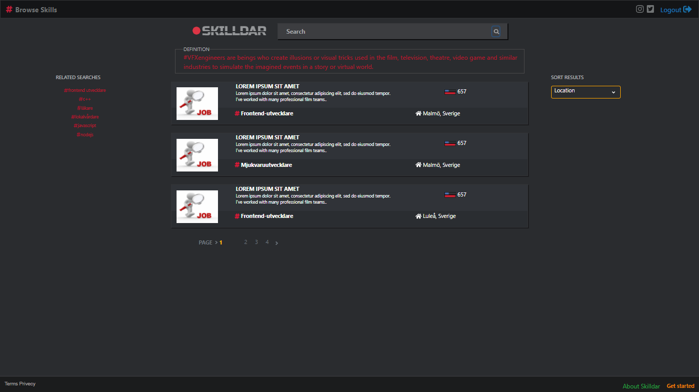
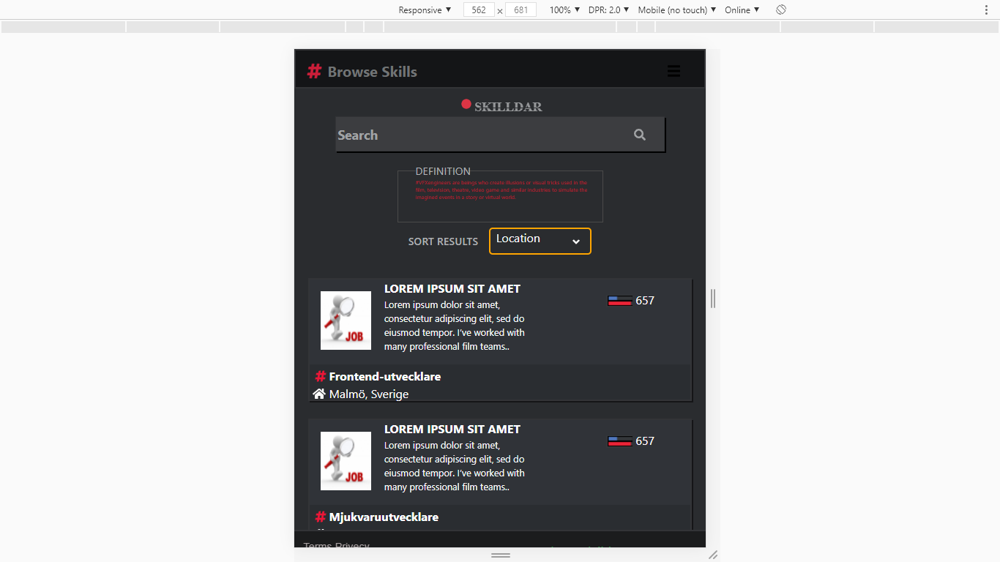
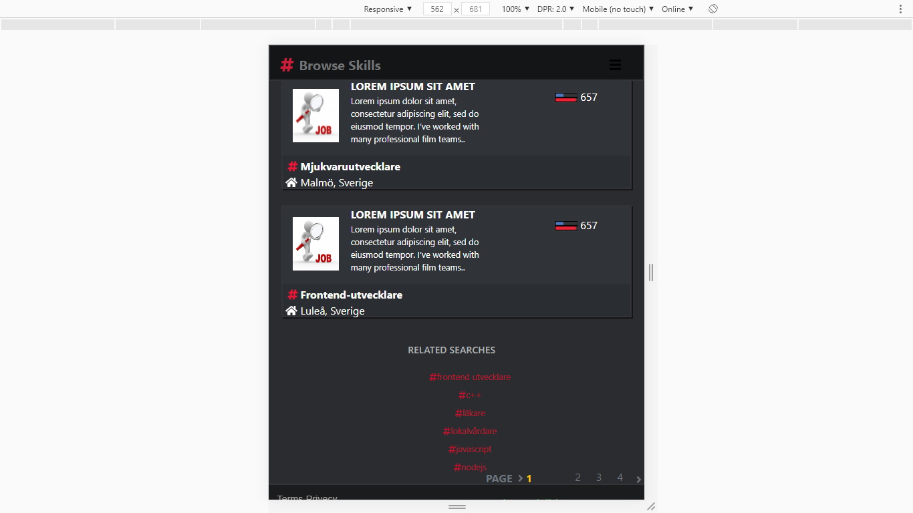
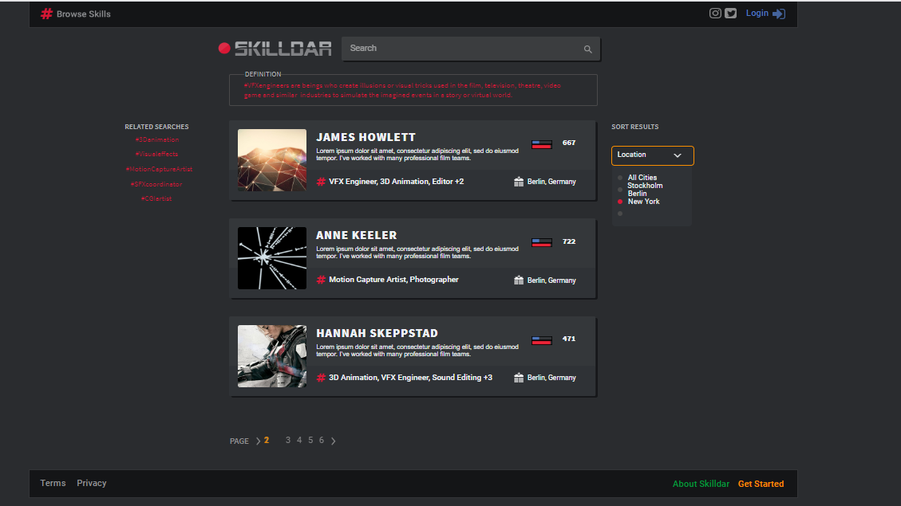

***JobApp***
---
### ***What does this project?*** 
***This project is for searching job, filtering and having a local info about your related past searches***
---

## How to set up the dev environment
### Clone the project
you shoud have:
#### Node 12.18.2
#### npm 6.14.5
#### react 16.13.1
#### access to .env file inside frontend folder which includes api-key

***To Run frontend ***
cd frontend 
### npm install  (it will take some time);
### npm start 
### the project will be started at localhost:3000

--- 
***To Run Backend *** 
### backend is only for serving the built app in the production
### npm install in the root
### cd frontend npm install 
### npm run built in the frontend folder
### cd ..  go back to the root 
### npm start
localhost:5000
--- 

***To test this project *** 
### cd frontend
### npm test in the terminal
### you will see some text and press letter a to test all files which incules test file
### react-scripts test will be shown and the result if it is fine will be
Test Suites: 3 passed, 3 total
Tests:       8 passed, 8 total
Snapshots:   0 total
Time:        78.478s
Ran all test suites.

--- 

### live ===>  http://159.89.94.168:5000/

---
### pc

---
### mobile, 

---
### the desing for this project based on this picture

