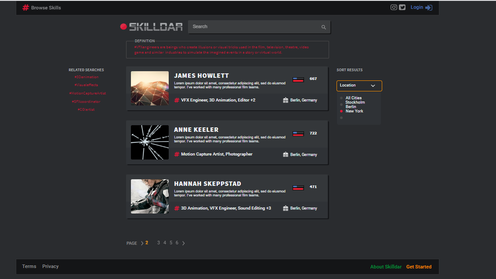

***JobApp***
---
What does this project does?
***this project is for searching job, filtering and having a local info about your related past searches
---

## How to set up the dev environment
### Clone the project
you shoud have:
#### Node 12.18.2
#### npm 6.14.5
#### react 16.13.1
#### access to .env file inside frontend folder which includes api-key

***To Run frontend ***
cd frontend 
### npm install  (it will take some time);
### npm start 
### the project will be started at localhost:3000

--- 
***To Run Backend *** 
### backend is only for serving the built app in the production
### npm install i the root
### cd frontend npm install 
### npm run built
### cd ..  go back to the root 
node index.js
localhost:5000
--- 

# the url for live  http://159.89.94.168:5000/

